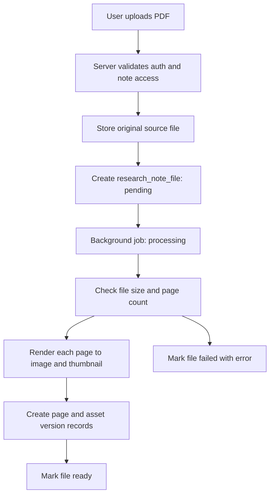
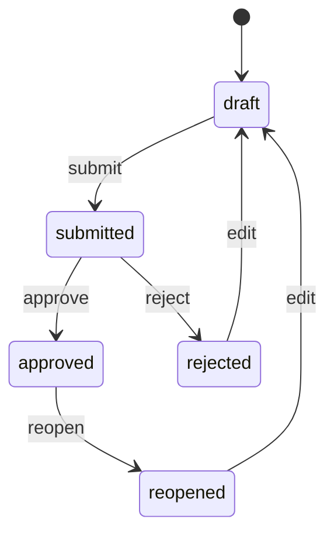

# Research Note PDF/Image Workflow Design

## Purpose

This document defines the target design for managing research note PDFs, images, editable page layouts, cover templates, signatures, authors, reviewers, approval workflow, and final PDF exports.

The key product rule is that LabNote must manage research notes as auditable records, not just generated PDFs. Original source files, rendered page assets, editable composition data, signatures, approval decisions, and exported PDFs should each have their own lifecycle.

## Design Principles

- Original PDF/image files are immutable once uploaded.
- Rendered page images can be regenerated or replaced through versioned assets.
- Editable document layout is stored as revisions, not as a single mutable blob.
- A signature used for approval is snapshotted so later profile signature changes do not alter past approvals.
- Approved research notes are locked. Further changes require reopening or creating a new revision.
- Final exported PDFs are saved as export records and should be reproducible from stored snapshots.
- The server determines user identity, author, updater, reviewer, and permissions from the auth token and project membership. The frontend must not be trusted for these identities.

## Domain Layers

The research note system should be split into six data layers.

| Layer | Description | Mutable |
| --- | --- | --- |
| Source file | Original uploaded PDF or image | No |
| Page asset | Rendered image/thumbnail for a source page | Versioned |
| Composition | Editable layout blocks and page ordering | Revisioned |
| Signature | User signature asset and usage snapshot | Signature versioned, snapshot immutable |
| Approval | Submit/approve/reject/reopen events | Append-only |
| Export | Final PDF package with cover/toc/body snapshots | Immutable |

## Storage Layout

Recommended storage layout:

```text
storage/
  notes/{note_id}/
    sources/{file_id}/
      original.pdf
      original.png
    pages/{page_id}/
      v{version_no}.webp
      v{version_no}-thumb.webp
    editor/
      {image_asset_id}.webp
    exports/{export_id}/
      research-note.pdf
  projects/{project_id}/
    covers/
      {cover_asset_id}.png
  signatures/{user_id}/
    {signature_id}.png
```

Storage keys must be normalized server-side and must not allow path traversal. A request payload should reference known IDs such as `page_id`, `asset_version_id`, `signature_id`, or `export_id`; direct arbitrary storage paths should not be trusted.

## Core Tables

### research_note_file

Stores immutable source files uploaded to a research note.

```text
id
note_id
uploaded_by_user_id
original_name
mime_type
file_size
checksum
storage_key
status: pending | processing | ready | failed | deleted
page_count
error_message
created_at
updated_at
```

Rules:

- `uploaded_by_user_id` is derived from the authenticated user.
- `checksum` is used for duplicate detection and audit traceability.
- `status` allows large PDFs to process asynchronously.
- Source files are not overwritten. Deletion should be soft deletion unless a retention policy says otherwise.

### research_note_page

Represents a logical page available inside a note.

```text
id
note_id
file_id
source_page_no
page_type: pdf_page | image | editor_image
sort_order
active_asset_version_id
status: ready | hidden | deleted
created_at
updated_at
```

Rules:

- `source_page_no` is the page number in the original source file.
- `sort_order` controls display/export order.
- A page can keep its logical identity while its image asset is replaced.

### research_note_page_asset_version

Stores versioned rendered/replaced image assets for a logical page.

```text
id
page_id
version_no
image_storage_key
thumbnail_storage_key
width
height
mime_type
checksum
created_by_user_id
change_reason
created_at
```

Rules:

- PDF rendering creates version 1 for each page.
- User image replacement creates version 2, 3, and so on.
- Old versions remain available for audit and rollback.

### research_note_document

Represents the editable document for a note.

```text
id
note_id
title
status: draft | submitted | approved | rejected | reopened | locked
current_revision_id
created_by_user_id
created_at
updated_at
```

Rules:

- One note can have one active document for the first version of the product.
- Later, multiple documents per note can support alternate layouts.

### research_note_document_revision

Stores revisioned editor payloads.

```text
id
document_id
revision_no
payload_json
created_by_user_id
change_summary
created_at
```

Rules:

- Every save creates a new revision or updates a short-lived autosave revision. For a simpler first implementation, create a new revision only on explicit "Save Layout".
- Approval references a specific revision.
- Approved revisions are immutable.

### user_signature

Stores user-managed signature assets.

```text
id
user_id
image_storage_key
checksum
status: active | revoked
created_at
revoked_at
```

Rules:

- A user can upload multiple signatures over time.
- Only one active signature should be used by default.
- Revoked signatures remain available for historical snapshots.

### research_note_signature_snapshot

Stores immutable signature usage at approval/sign time.

```text
id
note_id
document_id
document_revision_id
signer_user_id
signer_company_member_id
signature_id
role: author | reviewer | approver
signature_image_storage_key_snapshot
signed_at
```

Rules:

- The snapshot stores or copies the image used at that exact time.
- Changing a user's active signature later must not alter an approved PDF.

### research_note_assignment

Stores author/reviewer assignment.

```text
id
note_id
author_member_id
reviewer_member_id
assigned_by_user_id
assigned_at
updated_at
```

Rules:

- Author and reviewer must be company/project members.
- Project lead or company owner can reassign before approval.
- For a first implementation, author and reviewer can also remain on `research_note`, but this table is cleaner once history matters.

### research_note_approval_event

Append-only approval workflow log.

```text
id
note_id
document_id
document_revision_id
actor_user_id
actor_member_id
event_type: submitted | approved | rejected | reopened
comment
signature_snapshot_id
created_at
```

Rules:

- Approval state is derived from the latest event or mirrored to `research_note_document.status`.
- Rejections require a comment.
- Approval requires reviewer identity and signature snapshot.

### project_note_cover_template

Stores reusable project-level cover settings.

```text
id
project_id
title
organization_name
project_code
principal_investigator_member_id
project_period_text
layout_payload
background_image_storage_key
is_default
updated_by_user_id
created_at
updated_at
```

Rules:

- This is the editable template used before export.
- Existing `shared/cover_layout.json` can remain the default layout contract.
- User-facing values should be editable but default from project/company fields.

### research_note_export

Stores immutable final PDF export packages.

```text
id
project_id
created_by_user_id
status: pending | rendering | ready | failed
cover_snapshot_payload
toc_snapshot_payload
included_note_ids_json
included_revision_ids_json
pdf_storage_key
file_size
checksum
error_message
created_at
completed_at
```

Rules:

- Exports are not overwritten.
- Regenerating creates a new export.
- Cover and table of contents are snapshotted at export time.

## Workflow: Upload PDF



Validation:

- Allowed MIME types: `application/pdf`, `image/png`, `image/jpeg`, `image/webp`.
- Maximum source size should be configurable, for example 50 MB.
- Maximum PDF pages should be configurable, for example 100 pages.
- Rendering DPI should be configurable, for example 150 or 200 DPI.
- The server should never rely on MIME type alone; extension and basic file signature should be checked.

Failure behavior:

- If rendering fails, keep the source file and mark the file `failed`.
- If rendering partially succeeds, either roll back page creation or mark only complete pages ready. The simpler first implementation should roll back page rows and keep only the failed source file record.

## Workflow: Upload Image

Image upload follows the same source/page/asset model.

```text
1. Store original image as source file.
2. Normalize orientation and dimensions.
3. Create one research_note_page.
4. Create asset version 1 with full image and thumbnail.
5. Mark source file ready.
```

If a user later replaces the image for a page:

```text
1. Validate that the user can edit the note.
2. Store replacement image.
3. Create research_note_page_asset_version with version_no + 1.
4. Update research_note_page.active_asset_version_id.
5. Create an audit log entry.
```

The old asset version remains available for rollback.

## Image Editing Model

The editor should not modify the stored source image directly. It should store layout transformations in the document revision payload.

Supported editable properties:

```json
{
  "type": "source_image",
  "pageId": 12,
  "assetVersionId": 3,
  "x": 34,
  "y": 64,
  "w": 726,
  "h": 884,
  "rotation": 0,
  "crop": null,
  "opacity": 1,
  "locked": false
}
```

Optional crop shape:

```json
{
  "x": 0,
  "y": 0,
  "w": 1200,
  "h": 1600
}
```

Rules:

- Move, resize, crop, rotate, and replace are layout/asset operations, not destructive edits.
- If a visual correction truly changes the image bytes, create a new asset version.
- Text annotations are separate text blocks.
- Signatures are separate signature blocks.

## Document Composition Payload

Target payload shape:

```json
{
  "schemaVersion": 2,
  "title": "Experiment Log",
  "page": {
    "width": 794,
    "height": 1123,
    "background": "#ffffff",
    "template": "research-note-a4-v1"
  },
  "pages": [
    {
      "id": "page-1",
      "sourcePageId": 12,
      "blocks": [
        {
          "id": "source-12",
          "type": "source_image",
          "pageId": 12,
          "assetVersionId": 3,
          "x": 34,
          "y": 64,
          "w": 726,
          "h": 884,
          "rotation": 0
        },
        {
          "id": "note-title",
          "type": "text",
          "content": "Experiment Log",
          "x": 82,
          "y": 26,
          "w": 640,
          "h": 20,
          "locked": true,
          "style": {
            "fontSize": 13,
            "fontWeight": "normal",
            "textAlign": "left"
          }
        },
        {
          "id": "author-signature",
          "type": "signature",
          "role": "author",
          "signatureSnapshotId": null,
          "x": 258,
          "y": 975,
          "w": 194,
          "h": 58,
          "locked": true
        }
      ]
    }
  ],
  "meta": {
    "noteId": "note-id",
    "authorMemberId": 10,
    "reviewerMemberId": 11,
    "writtenDate": "2026-06-03",
    "reviewedDate": null
  }
}
```

Backward compatibility:

- Current `schemaVersion: 1` payloads can be migrated by wrapping the single `blocks` list into `pages[0].blocks`.
- Current `content-image` blocks should become `source_image` blocks linked to `sourcePageId`.

## Cover Management

There are two cover states:

1. Project cover template: editable defaults.
2. Export cover snapshot: immutable values used in a generated PDF.

Cover template fields:

- Organization/company name
- Project title
- Cover title
- Project code
- Principal investigator
- Project period
- Footer note
- Optional background/logo image
- Visibility toggles
- Layout payload

Export snapshot example:

```json
{
  "templateVersion": 1,
  "organizationName": "LABNOTE",
  "projectTitle": "Battery Materials Study",
  "coverTitle": "Research Notes",
  "projectCode": "LAB-2026-001",
  "principalInvestigatorName": "Kim Researcher",
  "projectPeriod": "2026-01-01 - 2026-12-31",
  "footerNote": "Generated by LabNote",
  "layout": {
    "page_width": 794,
    "page_height": 1123
  }
}
```

Rules:

- Editing the project cover template does not mutate previous exports.
- Export uses a snapshot copied from the template and current project/company/member data.
- If a project lead changes after export, old exported PDFs keep the old lead name.

## Body Content Management

The body should be managed through pages and revisions.

Expected user operations:

- Add source PDF/image.
- Reorder source pages.
- Hide/remove a page from the note.
- Replace a page image.
- Move/resize/crop/rotate source image on an editor page.
- Add text annotation.
- Save layout as revision.
- Submit revision for approval.
- Export approved revision.

Locking rules:

- Draft: author can edit.
- Submitted: author cannot edit unless reopened; reviewer can approve/reject.
- Approved: no editing. Export only uses the approved revision.
- Rejected: author can edit and resubmit.
- Reopened: behaves like draft but retains previous approval trail.

## Signature Management

User signature workflow:

```text
1. User uploads signature image.
2. Server validates image type and size.
3. Server stores image as user_signature.
4. The newest active signature becomes default.
5. Older active signatures are revoked or remain selectable depending on product policy.
```

Signing workflow:

```text
1. Actor clicks submit/approve.
2. Server validates actor role and note state.
3. Server finds actor's active signature.
4. Server creates research_note_signature_snapshot.
5. Server creates approval event.
6. Server updates document status.
```

Signature rules:

- Author signature is captured when submitting, or optionally when saving a signed draft.
- Reviewer signature is captured when approving.
- Missing signature should block approval unless the organization policy allows typed approval without signature.
- Signature snapshots must not change if the user's profile signature changes.

## Author, Worker, Reviewer, Approver Rules

Recommended roles:

| Role | Meaning | Source |
| --- | --- | --- |
| Author | Person responsible for writing the note | `research_note_assignment.author_member_id` |
| Reviewer | Person responsible for review/approval | `research_note_assignment.reviewer_member_id` |
| Project lead | Project manager/investigator | `project.owner_member_id` |
| Company owner | Organization owner | `company_member.role = owner` |
| System admin | Platform administrator | `useraccount.global_role = system_admin` |

Permission matrix:

| Action | Author | Reviewer | Project lead | Company owner | System admin |
| --- | --- | --- | --- | --- | --- |
| View project note | If project member | If project member | Yes | Yes | Yes |
| Upload source file | Yes for draft/rejected | No unless author | Yes | Yes | Yes |
| Edit layout | Yes for draft/rejected | No unless author | Yes before approval | Yes before approval | Yes |
| Change author/reviewer | No | No | Yes before approval | Yes before approval | Yes |
| Submit | Author | No | Yes if acting as author override | Yes if acting as override | Yes |
| Approve | No | Assigned reviewer | Yes if reviewer or override | Yes | Yes |
| Reject | No | Assigned reviewer | Yes if reviewer or override | Yes | Yes |
| Reopen approved note | No | No | Yes with audit reason | Yes with audit reason | Yes |
| Export PDF | Project member for approved notes | Project member | Yes | Yes | Yes |

Server-side checks must resolve the current user's company membership and project membership. The client must not submit `uploaded_by`, `last_updated_by`, or arbitrary author identity as trusted values.

## Approval State Machine



State rules:

- `submit` requires at least one saved document revision.
- `approve` requires assigned reviewer permission and active reviewer signature.
- `reject` requires reviewer permission and comment.
- `reopen` requires project lead, company owner, or system admin permission and reason.
- `approved` should store `approved_revision_id`.

## PDF Export

Export should be an asynchronous or tracked operation.

Export flow:

```text
1. User requests project export with selected note IDs.
2. Server validates project access.
3. Server selects approved revisions, unless draft export is explicitly allowed.
4. Server creates research_note_export with status pending.
5. Renderer snapshots cover and table of contents.
6. Renderer renders cover page.
7. Renderer renders table of contents.
8. Renderer renders each note page from document revisions and page assets.
9. Renderer inserts signature snapshots.
10. Renderer saves PDF and checksum.
11. Export status becomes ready.
```

PDF package order:

```text
1. Cover
2. Table of contents
3. Research note body pages
4. Optional appendix: source file list
5. Optional appendix: approval event summary
```

Export policy:

- Approved export: uses approved revisions only.
- Draft preview export: allowed only for editable users and clearly watermarked as draft.
- Re-export: creates a new `research_note_export` record.
- Download: downloads an existing ready export by ID.

## API Design

### Files and pages

```text
POST   /research-notes/{note_id}/files
GET    /research-notes/{note_id}/files
GET    /research-notes/{note_id}/pages
PUT    /research-notes/{note_id}/pages/order
POST   /research-note-pages/{page_id}/asset-versions
POST   /research-note-pages/{page_id}/restore-version/{version_id}
```

### Documents and revisions

```text
GET    /research-notes/{note_id}/document
POST   /research-notes/{note_id}/document
POST   /research-note-documents/{document_id}/revisions
GET    /research-note-documents/{document_id}/revisions
GET    /research-note-document-revisions/{revision_id}
```

### Approval

```text
GET    /research-notes/{note_id}/assignment
PUT    /research-notes/{note_id}/assignment
POST   /research-notes/{note_id}/submit
POST   /research-notes/{note_id}/approve
POST   /research-notes/{note_id}/reject
POST   /research-notes/{note_id}/reopen
GET    /research-notes/{note_id}/approval-events
```

### Signatures

```text
POST   /users/me/signatures
GET    /users/me/signatures
PUT    /users/me/signatures/{signature_id}/activate
DELETE /users/me/signatures/{signature_id}
```

### Cover and export

```text
GET    /projects/{project_id}/cover-template
PUT    /projects/{project_id}/cover-template
POST   /projects/{project_id}/exports
GET    /projects/{project_id}/exports
GET    /exports/{export_id}
GET    /exports/{export_id}/download
```

## Frontend Structure

The current single large workspace page should be split into feature modules.

Recommended modules:

```text
src/features/researchNotes/
  api/
  components/
    NoteFilePanel.tsx
    NotePageStrip.tsx
    NoteEditorCanvas.tsx
    NoteAssignmentPanel.tsx
    NoteApprovalPanel.tsx
    NoteExportPanel.tsx
  hooks/
    useResearchNoteFiles.ts
    useResearchNoteDocument.ts
    useNoteApproval.ts
  types.ts

src/features/signatures/
  SignatureManager.tsx

src/features/projectCover/
  ProjectCoverTemplateEditor.tsx
  ProjectCoverPreview.tsx
```

Editor UX:

- Left panel: uploaded files and pages.
- Center: A4 editor canvas.
- Right panel: selected block properties.
- Bottom/top action bar: save revision, submit, approve, reject, export.
- Approval banner: current status and locked-state reason.
- Signature panel: current user's active signature and missing-signature warning.

## Backend Structure

Recommended backend modules:

```text
backend/app/application/research_notes/
  file_service.py
  page_asset_service.py
  document_revision_service.py
  approval_service.py
  export_service.py

backend/app/infrastructure/pdf/
  renderer.py
  splitter.py

backend/app/presentation/routers/
  research_note_files.py
  research_note_pages.py
  research_note_documents.py
  research_note_approvals.py
  research_note_exports.py
```

The domain/application layer should accept `current_user` or an authorization context and should not trust IDs supplied by request bodies for actor identity.

## Implementation Plan

### Phase 1: Security and model alignment

Scope:

- Add auth and project membership checks to research note, file, and document APIs.
- Stop accepting trusted `uploaded_by` and `last_updated_by` from the client.
- Fix company join code DB length from 6 to 9.
- Add Alembic or an equivalent migration path.

Acceptance criteria:

- Unauthenticated access to note/file/document APIs returns 401.
- Non-project members receive 403.
- Uploaded file rows use the authenticated user's ID.
- PostgreSQL can store generated 9-character company codes.

### Phase 2: File processing state

Scope:

- Add `status`, `checksum`, `page_count`, and `error_message` to source files.
- Add page asset version table.
- Add configurable file size and page count limits.
- Convert PDF/image upload to source/page/asset model.

Acceptance criteria:

- PDF upload creates a source file record and page records.
- Image upload creates one page record.
- Failed processing is visible through API.
- Replacing a page image creates a new asset version.

### Phase 3: Document revisions

Scope:

- Add document revision table.
- Migrate existing document payload into revision 1.
- Update editor save to create revisions.
- Add `schemaVersion: 2` payload support.

Acceptance criteria:

- Saving a layout creates a revision.
- Existing layout documents can still load.
- Approved revisions cannot be mutated.

### Phase 4: Signatures and assignments

Scope:

- Add signature asset table.
- Add signature snapshot table.
- Add note assignment table or formalize assignment fields on `research_note`.
- Add signature manager UI.

Acceptance criteria:

- Users can upload and activate a signature.
- Submit/approve captures signature snapshots.
- Changing profile signature does not change historical approval snapshots.

### Phase 5: Approval workflow

Scope:

- Add approval event table.
- Implement submit, approve, reject, reopen endpoints.
- Lock document edits by status.
- Add approval panel UI.

Acceptance criteria:

- Draft can be submitted.
- Submitted can be approved or rejected by the assigned reviewer.
- Approved notes are locked.
- Reopen requires elevated project/company permission and a reason.

### Phase 6: Export records

Scope:

- Add export table.
- Create cover snapshot and table-of-contents snapshot.
- Render selected approved revisions into a saved PDF.
- Add export list and download UI.

Acceptance criteria:

- Export creates a persisted PDF file.
- Re-downloading uses the existing export.
- Re-export creates a new record.
- Previous exports do not change after cover/project/signature updates.

### Phase 7: Frontend decomposition

Scope:

- Split the current large workspace page into feature components.
- Centralize API error parsing.
- Add typed API clients for files, pages, revisions, approvals, signatures, and exports.

Acceptance criteria:

- Main page no longer owns all note/file/editor/approval state.
- Each feature panel can be tested independently.
- Existing project workspace behavior remains intact.

## Migration Notes From Current Code

Current code has several concepts that can be evolved instead of replaced all at once:

- `ResearchNoteFileORM` can become the source file table by adding status/checksum/page_count.
- `ResearchNotePageORM` can remain the logical page table by adding `note_id` and `active_asset_version_id`.
- Existing page image keys can be migrated into `research_note_page_asset_version` as version 1.
- `ResearchNoteDocumentORM.document_payload` can be migrated into `research_note_document_revision.payload_json`.
- `ProjectNoteCoverORM.template_payload` can feed the first `project_note_cover_template`.
- Existing `signature_data_url` can be converted into a first `user_signature` record per user.

## Open Decisions

- Should draft PDF export be allowed, and if so should it include a visible draft watermark?
- Should authors be allowed to select any project member as reviewer, or only project lead/company owner?
- Should a rejected note create a new revision automatically or continue from the rejected revision?
- Should page replacement preserve previous layout dimensions or re-fit the image automatically?
- Should final exports include an appendix with source file names and approval event summaries?

